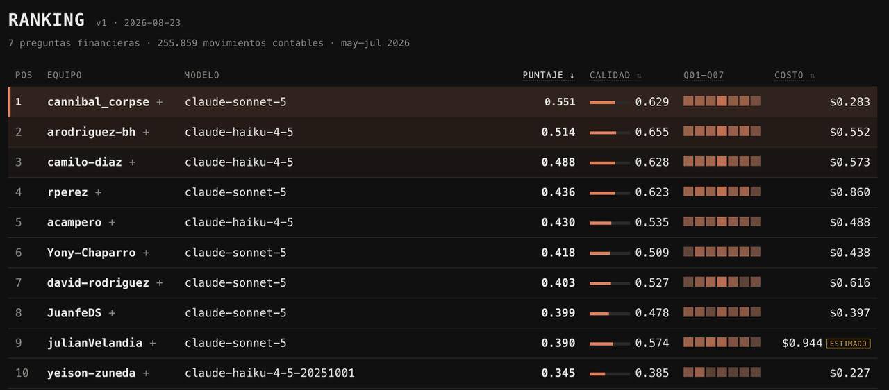
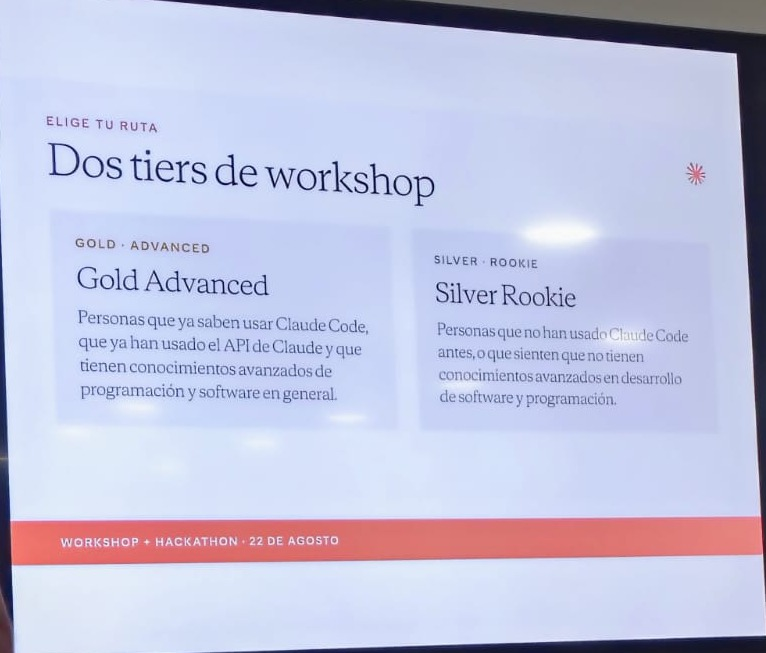

# Analista Financiero Agéntico

**Mi primer agente de IA.** Post-mortem del Quick Golden Bench — quedé 10 de 36 con el
costo más bajo del tablero.



Mira la última fila con cuidado. **Mi calidad, 0.385, es la más baja de todo el top 10** —
la siguiente peor es 0.478. No estoy cerca: hay un escalón.

Y aun así entré. Lo que me metió fue el costo: **$0.227**, el más barato del tablero —
menos de la mitad de lo que gastó el segundo puesto ($0.552) y cuatro veces menos que el
noveno ($0.944).

Esa fila es este repositorio en una imagen. **Optimicé muy bien lo que sabía medir. Quedé
último en lo que no sabía que se medía.** Este documento es la autopsia de por qué.

---

## Qué es esto

El 22 de agosto de 2026, en el hackathon de Claude Community Bogotá en Quick Logística,
construí un analista financiero agéntico: un agente que recibe preguntas en lenguaje
natural sobre 255.859 movimientos contables y tres meses de nómina, **escribe código
pandas nuevo, lo ejecuta en un sandbox local y responde con la cuenta hecha**.

No es un chatbot con respuestas cableadas. No hay siete respuestas guardadas esperando sus
siete preguntas. Hay un sandbox de Python vivo, un catálogo de funciones verificadas y un
bucle que itera hasta tener la cifra.

Funciona. Puedes correrlo hoy. Y es exactamente por eso que el post-mortem tiene sentido:
**el problema no fue que no funcionara.**

Esa mañana nunca había usado Claude Code desde una terminal.

---

## El resultado

| | |
|---|---|
| **Posición** | 10 de 36 |
| **Valor** (el ranking) | 0.345 |
| **Calidad** | 0.385 |
| **Costo** | $0.227 — el más bajo del tablero |
| Modelo | `claude-haiku-4-5` |
| Corrida | 219 s · 124.5k tokens |

Por pregunta:

| q01 | q02 | q03 | q04 | q05 | q06 | q07 |
|---:|---:|---:|---:|---:|---:|---:|
| 0.487 | **0.604** | 0.287 | 0.389 | 0.287 | 0.328 | 0.308 |

Guarda ese **0.604 de q02**. Es la única nota decente que saqué, y más adelante explica
todo lo demás.

---

## Elegí la ruta rookie

El workshop tenía dos rutas, y cada quien escogía la suya:



**Elegí Silver Rookie**, y era la elección honesta: no había tocado Claude Code en mi vida.

En Gold Advanced dieron la charla de agentes, y con ella el kit completo: las convenciones
contables del caso, la rúbrica de evaluación, el formato de entrega y los siete enunciados
oficiales. Todo publicado en el repositorio del organizador desde las 12:29.

En Silver Rookie el objetivo era otro: perderle el miedo a la terminal y construir algo que
analizara el caso. **Ni construir un agente, ni entregar al leaderboard.** A nosotros nadie
nos pidió competir.

**Decidí competir igual.** No era mi entrega y nadie me lo pidió. Venía con una estrategia
propia —un deep research previo y lo que había estudiado en Platzi sobre Claude y la API— y
quise ver hasta dónde llegaba.

Llegué al puesto 10 de 36.

Y eso es exactamente lo que hace útil el resto de este documento: **me metí por voluntad
propia a un juego cuyo manual se había explicado en la otra sala.** Ahí se ve con una
nitidez poco común qué se puede reconstruir por inferencia y qué no.

**Lo que deduje sin ver la rúbrica**, mirando el leaderboard y el caso:

- Que había que construir un agente con bucle, no un chatbot
- Que el puntaje penalizaba el costo, y aproximadamente cómo
- Que la traza había que emitirla en el formato de la API, no en uno propio
- Que las convenciones divergentes había que declararlas explícitamente

Las cuatro estaban escritas en la otra sala. Las cuatro las acerté.

**Lo que no se puede inferir es el vocabulario.** Que `PI` significa provisión. Que `RI` es
una reversión. Que "facturación real" excluye ambas. Eso no se deduce mirando datos:
alguien te lo tiene que decir, o lo lees.

Pasa en cualquier empresa: alguien cruza a un terreno que no es el suyo, deduce la mecánica
sin problema, y tropieza con las palabras. **Lo que te hunde en un dominio nuevo no son los
conceptos difíciles. Son las palabras fáciles que todo el mundo asume que ya conoces.**

### La línea de tiempo

| Hora (22-ago) | |
|---|---|
| **12:29** | El organizador publica los 7 enunciados, las convenciones y la rúbrica |
| 16:13 | Mi primera entrega |
| **19:17** | Mi última entrega |
| **21:53** | Ese repositorio llega a mi disco |

Dos horas y treinta y seis minutos tarde.

---

## Lo que escribí ese día, y lo que sé ahora

El README técnico de este repo lo escribí antes de conocer los resultados. Sigue en
[`agente/README.md`](agente/README.md). Es una cápsula del tiempo, y releerla es la parte
más incómoda del ejercicio.

> *"La calidad es una incógnita."*

Era 0.385. La más baja del top 10.

> *"No tenemos los enunciados oficiales."*

Estaban publicados desde las 12:29 de ese mismo día. Los tuve en el disco a las 21:53 —
después de escribir esa línea.

> *"Autoverificación obligatoria. La última consulta antes de responder recalcula la cifra
> principal por otra vía. Salió en 7/7."*

Salió en 7/7 porque al menos una de esas verificaciones no podía fallar. Estaba comprobando
un número contra sí mismo.

> *"En q05 el agente eligió otra convención que la de `verificar.py`. Ambas defendibles."*

El agente tenía razón y mi propio gate estaba equivocado. Las convenciones dicen que la
lectura literal de esa pregunta es la que eligió el agente. Estuve a punto de "corregirlo"
hacia la respuesta peor.

---

## El arco: un gate solo te protege de lo que sabe medir

Esa mañana aprendí *loop engineering* con el repositorio de Francisco Camacho: defines un
objetivo cuantitativo, defines un chequeo determinista, y dejas que el modelo itere contra
el chequeo hasta pasarlo.

Por la tarde apliqué la lección y construí mi gate: `agente/analista/verificar.py`, doce
comprobaciones que responden las siete preguntas sin usar el modelo.

Por la noche el gate daba **12 sobre 12 en verde**.

El evaluador me dio 0.385.

No es que el gate fallara. Es que mi gate medía si el ETL seguía en pie, y el evaluador
medía si el razonamiento era auditable. **Dos preguntas distintas, y yo solo había escrito
la primera.**

De doce chequeos, once eran detectores de humo: comprobaban que los datos cargaran, que las
filas cuadraran, que nada estuviera vacío. El único que comparaba una cifra de negocio
contra un valor esperado validaba **el número equivocado de q04** — respondí bien otra
pregunta, y está al final —, con una tolerancia de ±50 millones de pesos.

**Un gate solo te protege de lo que sabe medir. Todo lo demás pasa en verde — y el
verdadero aprendizaje está en las alertas rojas.**

---

## El hallazgo: la decisión que ganó también perdió

Esta es la parte que me sigue dando vueltas.

**La misma decisión que me dio el costo más bajo del tablero es la que hundió mi calidad.**

Precalculé todo. El ETL agrega los 255.859 movimientos una sola vez y deja tablas listas;
`helper.py` guarda las fórmulas financieras ya verificadas. El agente no recalcula nada:
consulta. Por eso costó $0.227 mientras otros gastaban el doble o el cuádruple.

Pero el 30% de la calidad no evaluaba la respuesta. Evaluaba **si el código ejecutado
sostiene la cifra** y **si el agente se verificó de verdad**.

Y el evaluador abre mi traza y encuentra esto:

```python
facturacion = helper.facturacion(por='total')
print(facturacion.to_string(index=False))
```

Dos líneas. ¿De dónde salen los cuarenta mil millones? De un archivo que él nunca abre.

Desde su lado, mi agente no calculó nada. **Consultó un oráculo.**

Ahora vuelve al desglose por pregunta:

| | Nota | ¿Recalcula desde los datos crudos, a la vista? |
|---|---:|---|
| **q02** | **0.604** | **Sí** — filtra por clase e imprime las tres diferencias reales |
| q01 | 0.487 | No menciona la clase contable ni una vez |
| q04 | 0.389 | Sí, pero con la definición equivocada |
| q06 | 0.328 | 14 llamadas al helper; admite en sus caveats que no ve los datos crudos |
| q07 | 0.308 | No menciona la clase contable ni una vez |
| q03 | 0.287 | Verificación falsa |
| q05 | 0.287 | Todo cuelga de la bandera opaca |

**Mi mejor nota es exactamente la única respuesta donde el agente hizo la cuenta delante
del evaluador.**

No es una correlación que fui a buscar. Es la que apareció sola cuando ordené la tabla.

---

## Qué haría distinto

1. **Hacer la cuenta a la vista, siempre.** Precalcular para ahorrar está bien; que el paso
   final sea invisible, no. La respuesta debe reconstruir la cifra desde los datos crudos
   aunque ya la tenga.
2. **Que toda verificación pueda fallar.** Antes de confiar en un chequeo, romperlo a
   propósito. Si no se pone rojo, no es un chequeo: es decoración.
3. **Escribir el glosario antes que el código.** Los cinco fallos son, en el fondo, cuatro
   palabras que no sabía: `FC`, `DV`, `PI`, `RI`.
4. **Desconfiar del verde.** 12/12 en un gate propio no dice que el trabajo esté bien. Dice
   que pasó los chequeos que se me ocurrieron.

---

## Correrlo

Node y Python con pandas. **Sin `npm install`** — el servidor usa solo módulos nativos de
Node.

```powershell
cd agente
python analista/etl.py          # una sola vez (~90 s), sin internet
node web/server.mjs             # abre http://localhost:3000
```

El dashboard y las siete respuestas ya generadas se leen del disco y **no cuestan nada**.
Solo el chat llama a la API; para eso hace falta una `ANTHROPIC_API_KEY` en `agente/.env`.
Una pregunta con Haiku cuesta alrededor de **US$0.012**.

Detalles en [`agente/README.md`](agente/README.md) e
[`agente/INSTRUCCIONES.md`](agente/INSTRUCCIONES.md).

**Los datos no están en este repositorio.** Son de Quick Logística y los publicó el
organizador (**Jairo Torregrosa**), no yo; el enlace está abajo. El ETL espera el CSV contable y los archivos de
nómina en la raíz.

### Qué hay dentro

| | |
|---|---|
| `agente/analista/etl.py` | Lee las fuentes una vez y deja las tablas listas |
| `agente/analista/helper.py` | Las funciones financieras. **Aquí vive el fallo de la línea 150** |
| `agente/analista/sandbox.py` | El proceso Python donde el agente ejecuta lo que escribe |
| `agente/analista/verificar.py` | El gate. 12 en verde, y aun así 0.385 |
| `agente/web/agente.mjs` | El motor: sandbox, prompt y bucle del agente |
| `agente/bench/answers/` | Las 7 respuestas que entregué, sin editar |
| `agente/bench/traces/` | Las 7 trazas que vio el evaluador, sin editar |

Las respuestas y las trazas están **tal como se enviaron**, con sus errores. Editarlas para
que se vieran mejor habría vaciado de sentido todo este documento.

---

## Los cinco fallos

Los separo en dos columnas, porque mezclarlas sería hacerme trampa. **A** es lo que no
podía saber desde mi sala. **B** es culpa mía, y no requería ninguna rúbrica.

| | Fallo | Qué pasó | Dónde |
|:--:|---|---|---|
| **A** | q04 — respondí bien otra pregunta | "Facturación real" excluye provisiones `PI` y reversiones `RI`; entregué la clase 4 completa. Mis "devoluciones" daban el **41.7% del bruto** — una bandera roja impresa en pantalla que no supe leer | `analista/helper.py:133` |
| **A** | q05 — la bandera invisible | La respuesta cuelga de una columna booleana que calculé en el ETL horas antes. Para el evaluador, esa columna no existe | `bench/traces/q05` |
| **B** | q03 — la verificación decorativa | `print(f"Diferencia: {…} (OK)")` — el `(OK)` es texto fijo. Se imprime pase lo que pase | `bench/answers/q03.json` |
| **B** | La verificación que no puede fallar | Ver abajo | `analista/helper.py:150` |
| **B** | La convención que regalaban | Los enunciados dicen en negrita que no use `CostCenterName`. Mi ETL hace exactamente eso | `analista/etl.py:113` |

**Tres de los cinco son míos.**

En el de q04 hay un detalle que me reconcilia un poco: el docstring que yo mismo escribí
dice que separo bruto, devoluciones y neto *"para que la respuesta pueda declarar la
convención"*. El instinto era correcto. Lo que faltaba eran dos palabras.

### El que más me enseñó

`agente/analista/helper.py:150`:

```python
# Verificacion por segunda via contra la columna Ingreso ya firmada.
control = d.groupby(clave)["Ingreso"].sum().sum()
if abs(g["FacturacionNeta"].sum() - control) > 1.0:
    raise DescuadreError("facturacion neta no cuadra con la columna Ingreso")
```

Tiene su propia excepción, tolerancia numérica y un comentario que dice "segunda vía".
Parece ingeniería seria.

Pero `FacturacionNeta` es `Σ crédito − Σ débito`, y `Ingreso` es `Σ (crédito − débito)`
sobre exactamente las mismas filas. **Son la misma operación**, y la suma de las
diferencias es igual a la diferencia de las sumas. Siempre. Por aritmética.

**Ese `if` es matemáticamente incapaz de dispararse: la diferencia siempre da 0.** La
segunda vía era la primera.

El `(OK)` de q03 se lee como un descuido de las once de la noche. Esto no: esto se lee como
lo que de verdad pasa en producción — código defensivo que tranquiliza a todo el mundo y no
está mirando nada.

---

## Créditos

El hackathon, el caso y las reglas los armó **Jairo Torregrosa**. Su repositorio es la
fuente de todo lo que aquí se cita — las convenciones contables, la rúbrica, el formato de
entrega y los siete enunciados:

- <https://github.com/JairoTorregrosa/charlas>
- <https://github.com/JairoTorregrosa/charlas/tree/main/2026-agents-bogota/hackathon>

No reproduzco ese material aquí. Está mejor en su casa, y ahí se mantiene actualizado.

**Francisco J. Camacho** enseñó el loop engineering que da forma a todo este proyecto —
objetivo cuantitativo, gate determinista, iterar contra el gate:
<https://github.com/pachocamacho1990/loop-engineering-demo>

**Claude Community Bogotá** organizó el evento y **Quick Logística** puso el caso, los
datos reales y el lugar.

El leaderboard cerró. Los números de este documento son los definitivos.

---

## Licencia

MIT — ver [`LICENSE`](LICENSE).

El código es mío y puedes usarlo. Los datos financieros son de Quick Logística y no están
aquí.
