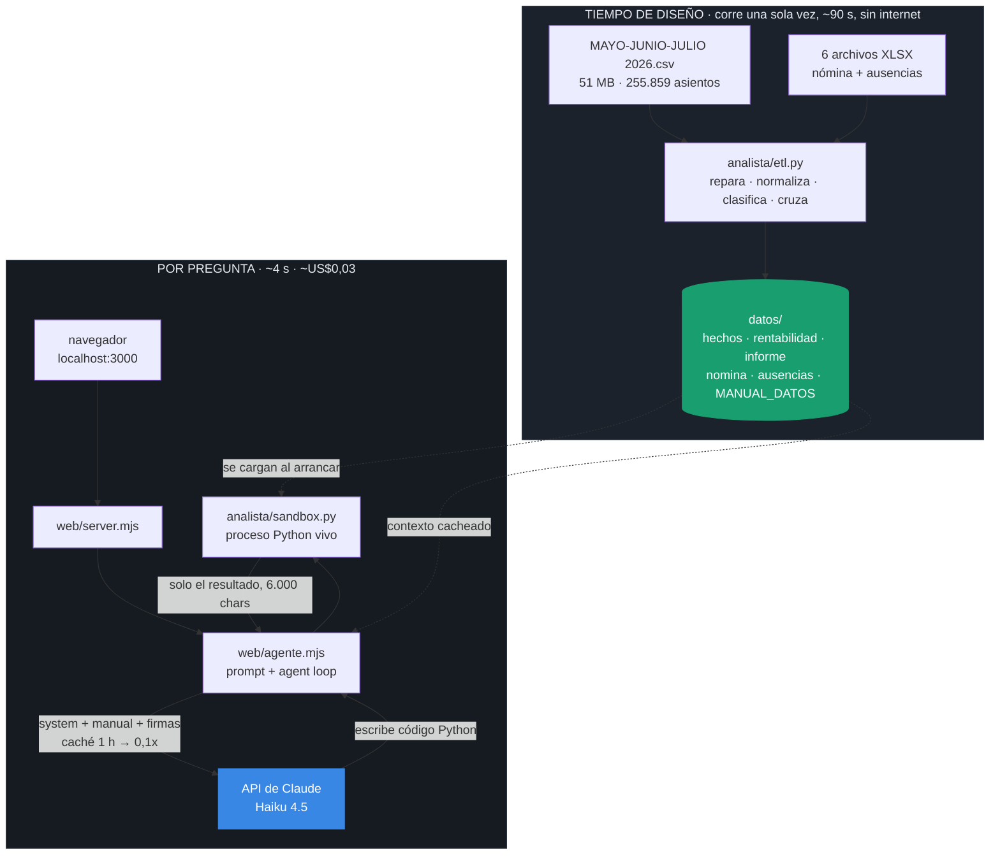

# Analista Financiero Agéntico — Quick Logística

Hackathon Claude Community Bogotá · 22 de agosto de 2026

> **Documento del 22 de agosto de 2026. Sin actualizar.**
>
> Lo escribí durante el hackathon, antes de conocer los resultados. Lo dejo tal cual
> porque su valor está justo ahí: muestra lo que creía saber esa noche. **Varias cosas
> de aquí resultaron falsas.** La calidad no fue la que esperaba, los enunciados
> oficiales sí estaban publicados, y las comparaciones con otros equipos las hice sobre
> un leaderboard en movimiento que aún no era el definitivo.
>
> Qué salió mal y por qué: [el post-mortem](../README.md).

Un analista financiero que responde preguntas en lenguaje natural sobre **255.859
movimientos contables** (mayo–julio 2026, 468 proyectos, 7 gerencias), escribiendo
y ejecutando su propio código Python. Corre entero en tu máquina.

> **El reto, textual:** *"Construir un sistema agéntico, eficiente y lo más económico
> posible, que pueda analizar los datos explicados y responder preguntas arbitrarias
> sobre la información como lo haría un analista financiero profesional."*

| Criterio del reto | Cómo se cumple |
|---|---|
| **Agéntico** — razona, no consulta | Escribe pandas nuevo y lo ejecuta; cruza contable ↔ nómina ↔ ausencias para explicar *por qué* |
| **Eficiente** — preguntas arbitrarias sin reescribir | `helper.py` de funciones verificadas **+** sandbox de código libre. Nada cableado a las 7 preguntas |
| **Económico** — el costo cuenta | Los 255k asientos se agregan **una vez**, no por pregunta · caché de 1 h · Haiku 4.5 → **US$0,032 por respuesta** |

---

## Arranque rápido

```powershell
cd agente

python analista/etl.py          # 1. una sola vez (~90 s), sin internet
python analista/verificar.py    # 2. comprueba los números sin gastar API
node web/server.mjs             # 3. abre http://localhost:3000
```

El paso 3 necesita la llave en un archivo `.env` **dentro de `agente/`** (al lado de
`analista/` y `web/`), sin comillas y sin espacios:

```
ANTHROPIC_API_KEY=sk-ant-...
```

El servidor imprime `ANTHROPIC_API_KEY: detectada` si la leyó bien.

> **Levántalo en tu propia terminal.** Si lo lanza un agente como tarea de fondo, el
> sistema de tareas lo cierra y el chat empieza a devolver `Failed to fetch`.

---

## Cómo funciona



**La decisión clave:** no se sube el CSV de 51 MB al sandbox de Anthropic. Se agrega
**una vez** en local y el modelo solo ve números pequeños. Eso vale 10–30× menos por
pregunta y evita timeouts al arrancar el contenedor. Es el patrón NVIDIA KGMON
(#1 en DABStep con un modelo ligero).

**Privacidad:** el CSV y las nóminas nunca salen de tu máquina. A la API viaja la
pregunta, el manual de datos y los resultados agregados que el agente decide mirar.

---

## Estructura

```
agente/
├── README.md                    este archivo
├── PRD.md                       el documento de producto: contexto y decisiones
├── INSTRUCCIONES.md             detalle operativo + cómo entregar al ranking
│
├── analista/                    ── la capa determinista (sin LLM) ──
│   ├── etl.py                   lee las fuentes 1 vez → datos/. Repara 58 filas rotas
│   ├── helper.py                11 funciones financieras verificadas por doble vía
│   ├── sandbox.py               proceso Python persistente donde el agente ejecuta
│   ├── verificar.py             EL GATE: las 7 preguntas resueltas sin LLM
│   └── validar_entrega.py       valida el paquete del ranking antes de enviarlo
│
├── web/                         ── la capa agéntica (Node puro, 0 npm) ──
│   ├── agente.mjs               sandbox + prompt + agent loop. El motor compartido
│   ├── server.mjs               servidor HTTP + SSE
│   ├── responder.mjs            genera datos/respuestas.json (pestaña del dashboard)
│   ├── bench.mjs                genera bench/ para el Quick Golden Bench
│   └── public/index.html        chat + dashboard + tabla. Sin build, sin dependencias
│
├── datos/                       ── generado por etl.py, borrable y regenerable ──
│   ├── hechos.parquet           4,7 MB · 255.859 asientos normalizados
│   ├── rentabilidad.parquet     1.259 filas proyecto × mes
│   ├── informe.parquet/.json    468 proyectos, junio vs julio (la tabla del caso)
│   ├── nomina.parquet           100.449 líneas, con proyecto asignado al 100%
│   ├── ausencias.parquet        4.901 novedades de personal
│   ├── series.json              series de 3 meses que alimentan el dashboard
│   ├── respuestas.json          las 7 respuestas con su código y su costo
│   └── MANUAL_DATOS.md          el "data manual" que se cachea en el prompt
│
├── bench/                       ── entrega al ranking ──
│   ├── answers/q01–q07.json     respuesta + cifras estructuradas + código
│   └── traces/q01–q07.events.jsonl   traza en formato stream-json
│
└── submit.py                    el enviador oficial del bench
```

**No se toca** nada fuera de `agente/`: `Caso Financiero.docx`, `Preguntas.docx`, el
CSV y `Nomina/` quedan intactos donde los dejó el organizador.

---

## Los comandos

| Comando | Qué hace | ¿Gasta API? |
|---|---|:---:|
| `python analista/etl.py` | Lee las fuentes y escribe `datos/`. ~90 s | no |
| `python analista/verificar.py` | Responde las 7 preguntas solo con pandas. 12 chequeos | no |
| `node web/server.mjs` | La página en `localhost:3000` | solo al preguntar |
| `node web/responder.mjs` | Genera la pestaña "Las 7 preguntas" | sí, ~US$0,25 |
| `node web/bench.mjs` | Arma la entrega del ranking | sí, ~US$0,23 |
| `python analista/validar_entrega.py` | Valida el paquete antes de enviar | no |

`node web/bench.mjs 2 5` regenera solo esas dos preguntas y conserva el resto.

Variables opcionales: `MODELO` (por defecto `claude-haiku-4-5-20251001`),
`MAX_TURNOS` (14), `PUERTO` (3000).

---

## La página

**Dashboard** (principal) — KPIs del mes, evolución del margen por gerencia (mayo→julio),
proyectos con mayor variación junio→julio, y un comparador donde eliges proyectos y los
ves lado a lado (junio ○ → julio ●).

**Las 7 preguntas** — las respuestas del caso, cada una con el código que ejecutó,
su salida y el costo real en USD.

**Detalle** — las 468 filas del Caso Financiero: Gerencia, Proyecto, Ingreso/Costo/%
de junio y julio, Variación, Δ Ingreso, Utilidad y el semáforo 🟢🔴🟡. Ordenable por
cualquier columna.

**Chat** — pregunta libre. Muestra en vivo el código que ejecuta y lo que cuesta.

---

## Qué se descubrió en los datos

Todo verificado corriendo pandas, no asumido.

**Margen por gerencia** — `(Ingreso − Costo) / Ingreso`, costo = cuentas clase 6 y 7:

| Gerencia | Mayo | Junio | Julio | Lectura |
|---|---:|---:|---:|---|
| LAST MILE COLOMBIA | 19,2% | 20,2% | 20,5% | **Mejor evolución real** |
| LONG HAUL | 13,2% | 13,4% | 14,0% | Mejora sostenida |
| FIRST MILE | 14,5% | 14,0% | 14,0% | Plano |
| **WAREHOUSE** | **18,1%** | **17,4%** | **13,8%** | **La caída del trimestre** |
| COURIER COLOMBIA | −18,2% | 9,8% | 19,1% | **Trampa de materialidad** |

**Facturación neta** (clase 4, crédito − débito): mayo $23.365.566.436 · junio
$24.302.130.865 · julio $24.553.077.703.

**Cuatro trampas que el dataset tiende:**

1. **Materialidad.** COURIER sube 37,3 pp — el salto más grande de la tabla — pero
   mueve **$4,9 millones al mes** en una compañía que factura **$24.500 millones**.
   Responder "COURIER" es aritméticamente correcto y profesionalmente inútil.
2. **`Date` siempre cae dentro de su `Period`.** Verificado con crosstab: la pregunta
   del gasto retroactivo **no se responde en el contable**. Está en la nómina
   (`Period` ≠ `PeriodPayment`) y en el texto de `Observation`.
3. **58 filas rotas con dos averías distintas** (ver abajo).
4. **Proyectos con ingreso 0 y costo > 0.** Su margen es `NaN`, no menos infinito.
   Sin un piso de materialidad, el ranking de "peores" lo copa el Proyecto 953:
   $175.091 de ingreso y −515 pp de "variación".

---

## Los errores del camino

Esto es lo que realmente pasó. Cada nodo rojo costó tiempo; cada verde fue la
corrección que quedó en el código.

```mermaid
flowchart TB
    A["<b>El pivote</b><br/>La práctica era logística (OTD/OTIF).<br/>El caso real era financiero"]:::warn
    A --> A2["Se conserva track_mock/ como<br/>referencia probada en vez de borrarla"]:::fix

    A2 --> B["<b>CSV: 58 filas con ';' de más</b><br/>Se asume una sola causa<br/>y se fusiona todo en Observation"]:::err
    B --> B2["2 filas quedan con Gerencia = '0'"]:::err
    B2 --> B3["Son DOS averías distintas:<br/>56 con ';' dentro del texto<br/>2 con un ';' colgando al final.<br/>Se arreglan en orden"]:::fix

    B3 --> C["<b>Nómina: join por RowId</b><br/>Cobertura 2,4%"]:::err
    C --> C2["El contable numera 2,4,6…<br/>y la nómina 1,3,5…<br/>RowId NO es llave"]:::err
    C2 --> C3["Puente empleado × periodo:<br/>95,4% unívoco → cobertura 100%"]:::fix

    C3 --> D["<b>Agente: tope de 6 turnos</b><br/>'Alcancé el límite sin cerrar el análisis'<br/>Se pierde el trabajo ya pagado"]:::err
    D --> D2["14 turnos + el último SIN herramientas:<br/>obligado a concluir.<br/>Y se le enseña a AGRUPAR consultas"]:::fix

    D2 --> E["<b>Q1: responde 'Proyecto 3274'</b><br/>La pregunta pedía una LÍNEA"]:::err
    E --> E2["'Línea' es vocabulario del negocio<br/>y no estaba en el manual de datos"]:::err
    E2 --> E3["Glosario: LÍNEA = gerencia.<br/>Se regenera solo esa pregunta (US$0,02).<br/>Ahora detecta sola la trampa de COURIER"]:::fix

    E3 --> F["<b>7 consultas gastadas adivinando<br/>nombres de columnas</b>"]:::err
    F --> F2["Se documentan las columnas exactas<br/>que devuelve cada función"]:::fix

    F2 --> G["<b>.env: la llave no se guardaba</b><br/>Notepad abierto sin Ctrl+S,<br/>luego con comillas"]:::err
    G --> G2["Validación que muestra longitud y prefijo<br/>sin imprimir la llave"]:::fix

    G2 --> H["<b>submit.py: UnicodeEncodeError</b><br/>Imprime '→', la consola usa cp1252.<br/>Arma el zip y muere ANTES de enviarlo"]:::err
    H --> H2["Parecía que no pasaba nada.<br/>Se envía con PYTHONUTF8=1"]:::fix

    H2 --> I["<b>run-id personalizado</b><br/>36 de 36 corridas usan el formato<br/>por defecto; la nuestra no"]:::warn
    I --> I2["Reenvío con el formato estándar"]:::fix

    I2 --> J["<b>'Failed to fetch' en el chat</b><br/>El servidor, lanzado como tarea de fondo,<br/>fue cerrado 3 veces"]:::err
    J --> J2["Se levanta desde la terminal del usuario,<br/>fuera del ciclo de vida del agente"]:::fix

    classDef err fill:#d03b3b,stroke:#d03b3b,color:#fff
    classDef warn fill:#c98500,stroke:#c98500,color:#fff
    classDef fix fill:#0ca30c,stroke:#0ca30c,color:#fff
```



### Lo que cada error dejó como regla

| Error | Regla que quedó |
|---|---|
| Las 58 filas rotas | Un síntoma parecido puede tener causas distintas. Contar los campos no basta: hay que **mirar la línea cruda** |
| El join por `RowId` | Una llave que "debería" funcionar no funciona hasta que **mides la cobertura** |
| El tope de 6 turnos | Un límite de seguridad que **destruye el trabajo pagado** está mal diseñado. Degradar > fallar |
| "Proyecto 3274" | Si el agente responde al nivel equivocado, el que no explicó el vocabulario **fui yo**, no él |
| Las columnas adivinadas | En un agente, **documentación mala = dinero**. Cada nombre inventado es un turno pagado |
| `submit.py` en Windows | Un programa que falla **después** de trabajar y **antes** de entregar es el peor tipo de bug: parece que no hizo nada |
| El servidor cerrado 3 veces | La infraestructura que sostiene una demo **debe ser del usuario**, no de la sesión del agente |

---

## Lo que se hizo distinto al resto del campo

Del leaderboard del Quick Golden Bench (36 entregas):

**1. Se llenó `answer` con cifras crudas.** Pesa 3/10 en cinco de las siete preguntas
y estaba en **0.00 para casi todos**, incluido el primer puesto. Se entrega
`23365566436.3`, no `"$23.366 millones"`.

**2. Autoverificación obligatoria.** La última consulta antes de responder recalcula
la cifra principal **por otra vía** e imprime `VERIFICACION metodo_1=… metodo_2=…
diferencia=…`. Salió en 7/7 y queda visible en la traza.

**3. Traza en el formato que el evaluador sabe leer.** Un equipo sacó 0.00 en
evidencia y verificación con la nota *"events.jsonl no convertible"*. Aquí se emite
stream-json con ids de `tool_use` reales, sus `tool_result` emparejados y
`total_cost_usd` — para que el costo sea **reportado y no estimado**.

**4. El costo como estrategia, no como consecuencia.** `valor = calidad × 2/(2+coste)`.
Nuestra corrida: **US$0,2273**. El primer puesto: US$0,552. Ese solo factor vale
×0,898 contra ×0,784.

| | q01 | q02 | q03 | q04 | q05 | q06 | q07 | Total |
|---|---:|---:|---:|---:|---:|---:|---:|---:|
| Consultas | 3 | 4 | 3 | 2 | 3 | 8 | 3 | 26 |
| Costo USD | 0,022 | 0,043 | 0,021 | **0,009** | 0,034 | 0,075 | 0,023 | **0,227** |

---

## Estado al cierre

- ✅ ETL, `helper.py`, sandbox, servidor y dashboard funcionando
- ✅ `verificar.py`: **12/12 chequeos verdes**, sin LLM
- ✅ Las 7 preguntas respondidas y verificadas contra el cálculo local
- ✅ Dos entregas recibidas por el bench: `envio-161412-haiku45` y
  `20260823-001705-claude-haiku-4-5-20251001`
- ⏳ **Pendiente de puntuación.** El evaluador no incorpora corridas nuevas desde las
  20:20 UTC; nuestro envío entró a las 21:14

### Lo que no está resuelto

- **No tenemos los enunciados oficiales** (`preguntas/qNN.md`). La forma de `answer`
  se dedujo del `Preguntas.docx`. Si algún enunciado pide una desagregación distinta,
  esa pregunta se respondió a ciegas.
- **En q05 el agente eligió otra convención que la de `verificar.py`**: interpretó
  "gasto" como cuentas clase 5 (10,5% retroactivo en julio); el gate usaba clases
  5+6+7 (11,3% bruto). Ambas defendibles, y él declaró la suya en `conventions` — pero
  si el gold usó la otra, esa pregunta castiga.
- **La calidad es una incógnita.** El factor de costo ×0,898 es un hecho medido; el
  puntaje final lo decide un evaluador contra respuestas expertas que no conocemos.

Si aparece el desglose por dimensión, regenerar una pregunta suelta cuesta ~US$0,02
(`node web/bench.mjs 5`) y se reenvía con un `--run-id` nuevo.
